# Openwallet

  

<h3 align="center">The universal standard for digital payments</h3>

  <em>Developed by fourXpay</em>

---

## Team Members

- **Alejandro Sánchez García**
- **Alan Fernando Sánchez Romero**
- **Jesús Andrés Mondragón Tenorio**

---

## Project Description

**Openwallet** is a mobile application that redefines how we manage money in our daily lives. Designed to be simple, fast, and secure, it allows users to:

- Make quick and secure **transfers**
- Send and receive payments using **QR codes**
- Make **donations** to social causes
- **Schedule automatic payments** with ease

### Open Payments Technology

The platform leverages **Interledger's Open Payments** technology, ensuring universal compatibility across networks and instant, secure transactions. From sending money to a friend to supporting a social project, everything can be done in one place.

### User Experience

The app's design prioritizes the user experience: intuitive interface, smooth navigation, and practical tools that make Openwallet a natural part of your routine. Ideal for both **individual users** and **small businesses**.

---

## Technology Stack

During the **24-hour hackathon**, our team worked intensively combining modern and powerful technologies:

- **React Native** - Cross-platform mobile interface and experience
- **Open Payments (Interledger)** - Payment interoperability
- **Dynamic QR codes** - Seamless transactions between users
- **Secure authentication** - End-to-end encryption

---

## Login

To access the banking platform, users must log in with a **username and password**, ensuring data privacy and financial security. Each account is protected by secure authentication and end-to-end encryption.

  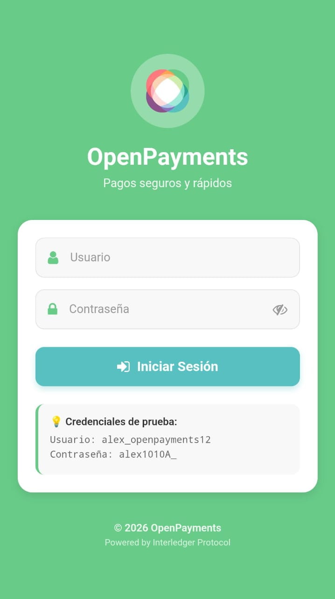

---

## Main Menu

The menu serves as the **control center** of Openwallet. From here, users can quickly and intuitively access all available features and services.

  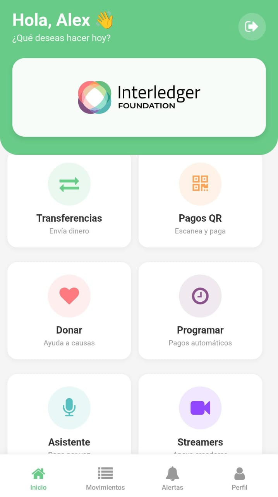

---

## Openwallet Services

### Transfers

We couldn't call Openwallet a financial app without offering the essential service of every bank: **money transfers**. 

But we went further: we designed a **smooth, user-friendly experience** that lets you send money to your contacts with just a few taps. Thanks to Open Payments integration, transfers are **instant and secure**, with no complications.

  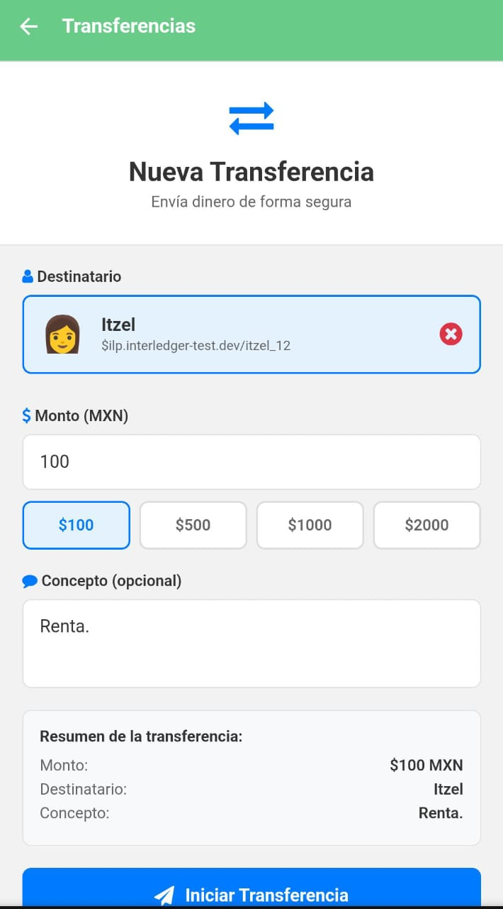

---

### QR Code

Openwallet makes in-person and remote payments easy with **dynamic QR codes**. Users can:

- **Generate their own QR code** to receive payments
- **Scan someone else's code** to send money instantly

Perfect for small businesses, events, or quick exchanges—no need to type account details.

  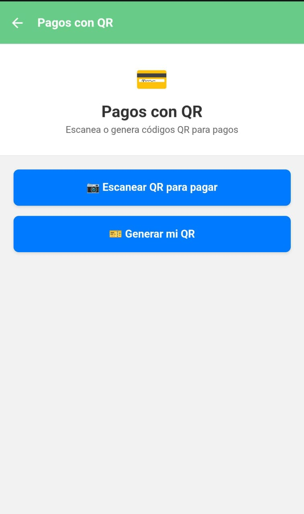
  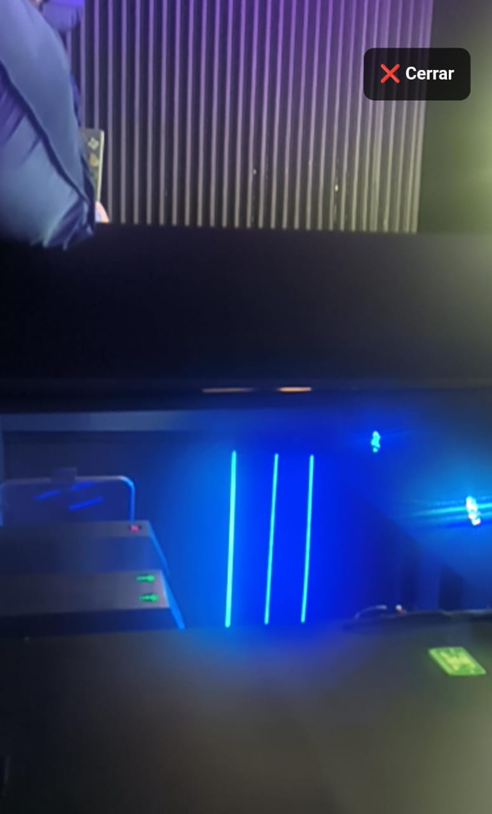
  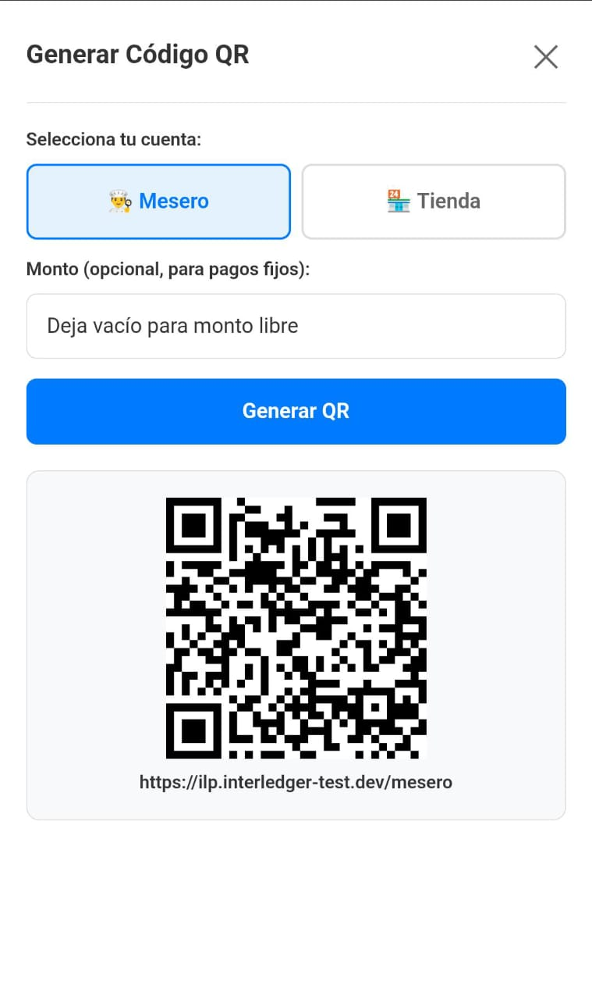

---

### Donations

Openwallet doesn't just improve users' lives—it aims to **make a difference for others**. 

Within the app, users can easily donate to projects, foundations, or social causes, choosing who to support and how much to give, **starting from as little as 1 peso**.

We believe in a more human digital economy—where helping is as easy as sending a message.

  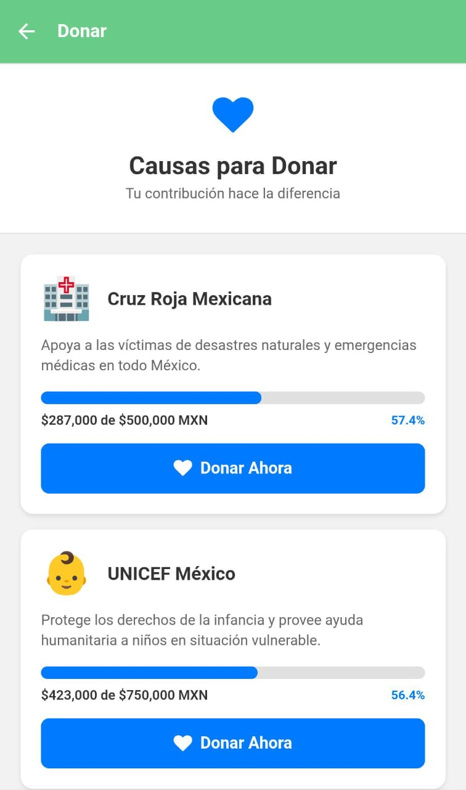
  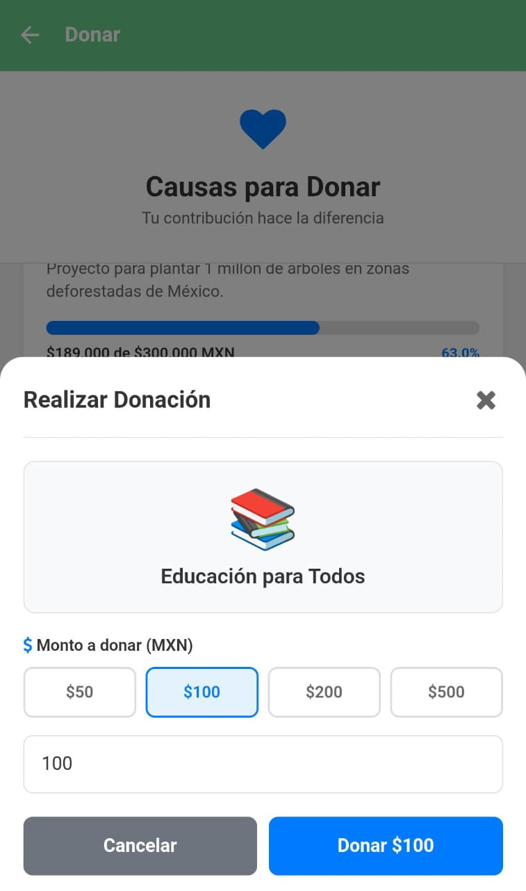

---

### Scheduled Payments

One of Openwallet's most useful features is **payment automation**. 

You can **schedule future or recurring payments** (for example, rent, bills, or subscriptions) and never worry about forgetting again. The system notifies you before executing each payment and ensures funds are released correctly, offering **peace of mind and full control** over your finances.

  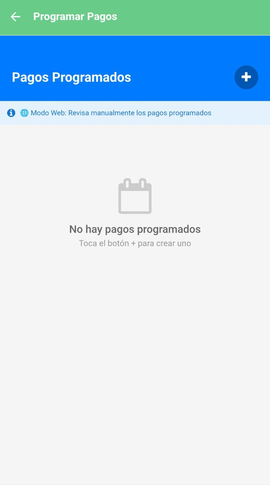
  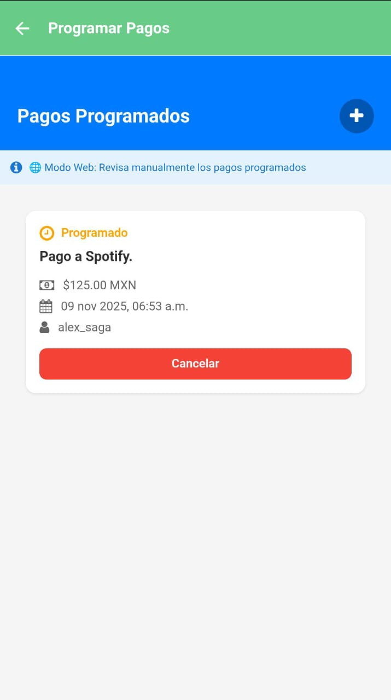

---

### Support for Streamers

Openwallet also empowers **content creators**. 

Users can **instantly donate to streamers**, directly through the app, without intermediaries or high fees. Streamers can generate their **personal QR code or payment link**, receive real-time contributions, and manage their income transparently.

  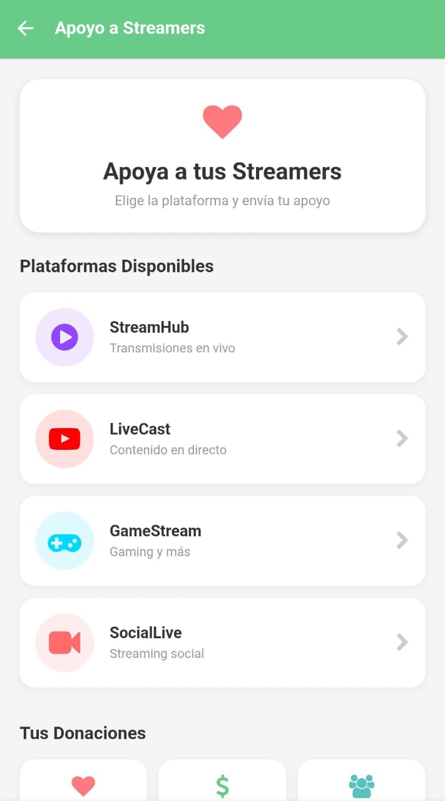
  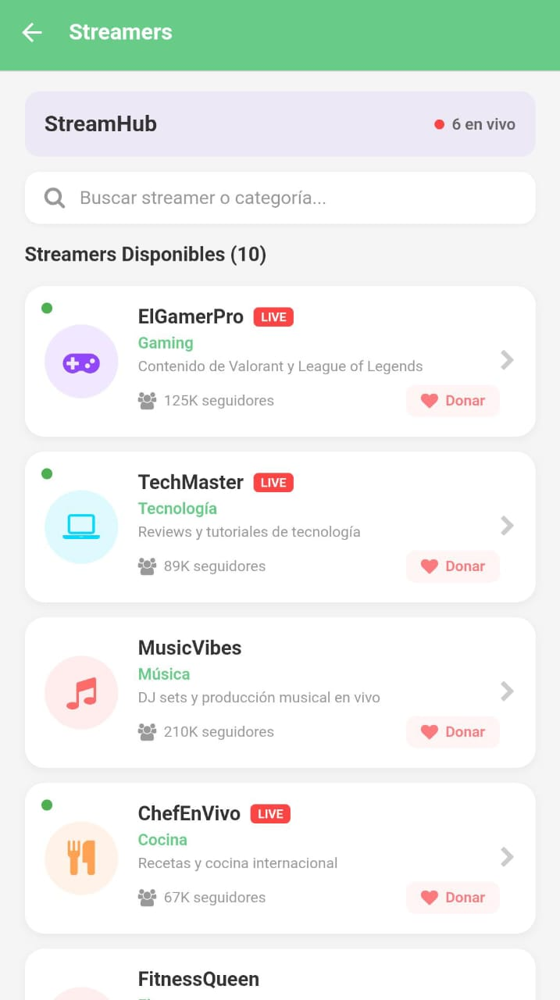

---

### Personal Assistant

To make the experience even more practical, Openwallet includes an **intelligent assistant** that helps users:

- Check their balance and transaction history
- Remind them of upcoming payments
- Suggest financial optimizations
- Generate QR codes or initiate transfers via voice or text commands

Your own **digital financial advisor**, available 24/7.

  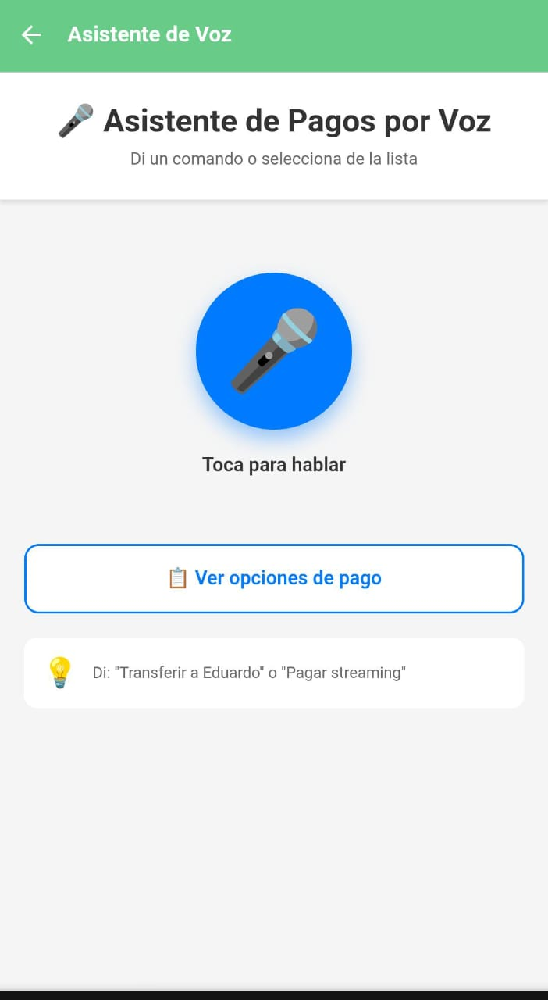
  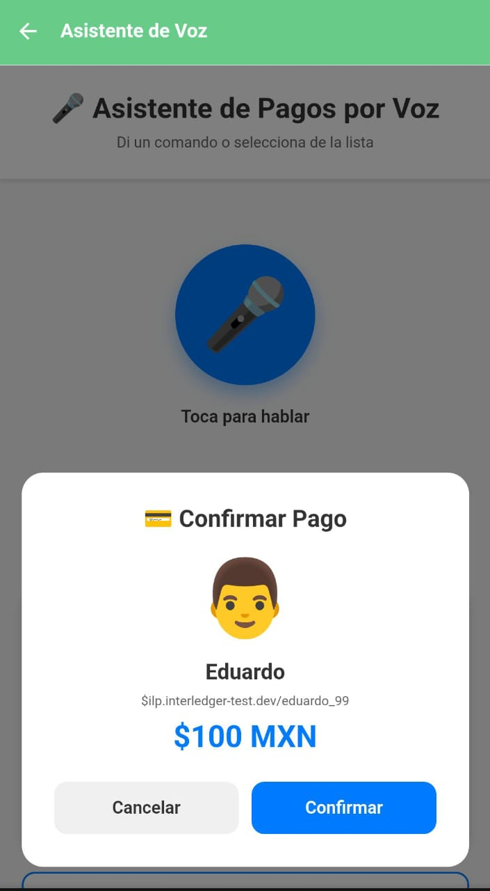

---

  <strong>Made with love by fourXpay</strong>

